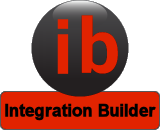
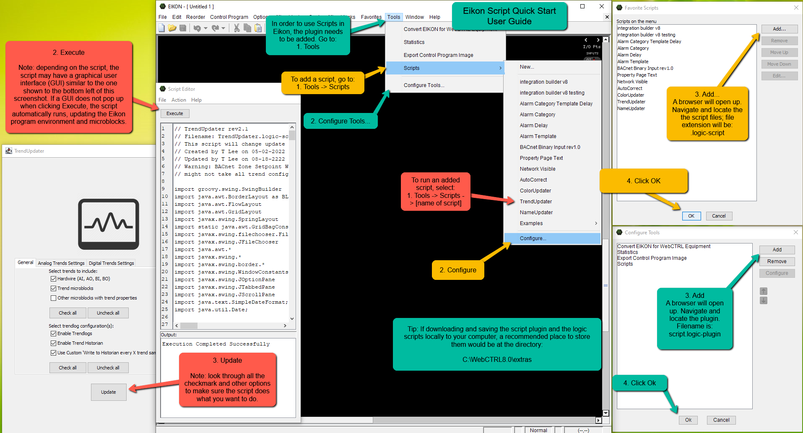

# Integration Builder

WebCTRL is a trademark of Automated Logic Corporation.  Any other trademarks mentioned herein are the property of their respective owners.

## Overview

Integration Builder is a groovy script which is meant to be executed in the EIKON application. [EIKON](https://www.automatedlogic.com/en/products/webctrl-building-automation-system/engineering-tools/eikon/) is a graphical programming tool which comes installed alongside [WebCTRL](https://www.automatedlogic.com/en/products/webctrl-building-automation-system/). Compatability has been tested for use with WebCTRL9.0 only. The purpose of this script is to generate a control program using data from a BACnet discovery file in either CSV or XML format. The script generates input and output network points as well as basic alarming logic.

## Installation

1. You will need a licensed WebCTRL9.0 installation. And you should enable the script plugin for EIKON. Refer to the following screenshot if you are unfamiliar with EIKON scripting.

2. Download [*integrationbuilder.zip*](https://github.com/automatic-controls/integration-builder-eikon-script/releases/latest/download/integrationbuilder.zip) and extract the contents to *C:\\WebCTRL9.0\\resources\\integrationbuilder*.
3. Add [*Integration Builder.logic-script*](./Integration%20Builder.logic-script) to your script list in EIKON.
4. Execute the script to verify that it renders the GUI correctly. The script will automatically download and install an appropriate version of [groovy-swing](https://mvnrepository.com/artifact/org.codehaus.groovy/groovy-swing) if it doesn't already exist. In which case, you will be prompted to restart EIKON.
5. Feel free to edit *integrationbuilder/logicsymbols/&lt;blue,gray&gt;/program_header.logicsymbol* to add your own company's logo to the header.

## Usage

1. Create a BACnet discovery file using software of your choice (e.g, [YABE](https://sourceforge.net/projects/yetanotherbacnetexplorer/)).
   - XML formatted files are expected to have the *.discovery* file extension.
   - CSV formatted files may use the *.csv* file extension.
2. Open a blank EIKON program and run the Integration Builder script.
3. Go through the settings in each tab of the script's GUI and make your desired selections.
4. Select your BACnet discovery file in the script's GUI and click **Generate**.
5. Wait for the script generate the control program. You can close the script once it's complete.